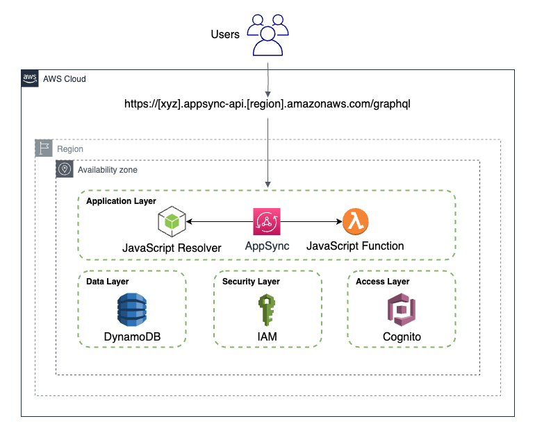

# AppSync API with JavaScript resolver

[](https://gitpod.io/#https://github.com/kavichu/aws-appsync-terraform.git)

# Architecture



# Requirements

- An S3 bucket to use as the backend for terraform

# Initialize the working directory

```sh
terraform init -backend-config="bucket=<YOUR_BACKEND_S3_BUCKET_NAME>"
```

# Package the functions

Before running terraform apply, you need the packaged functions as zip files

```sh
bash package.sh
```

# Deploy

```sh
terraform plan
terraform apply
```

# Clean up

```sh
terraform destroy
```
